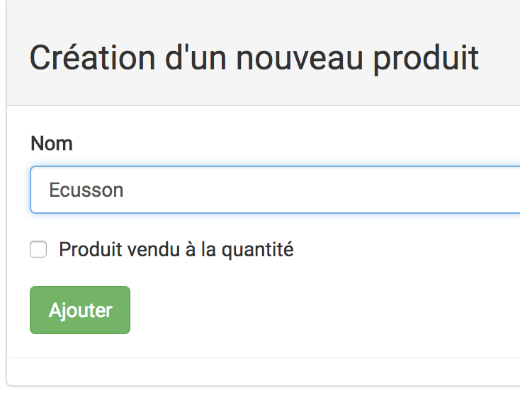
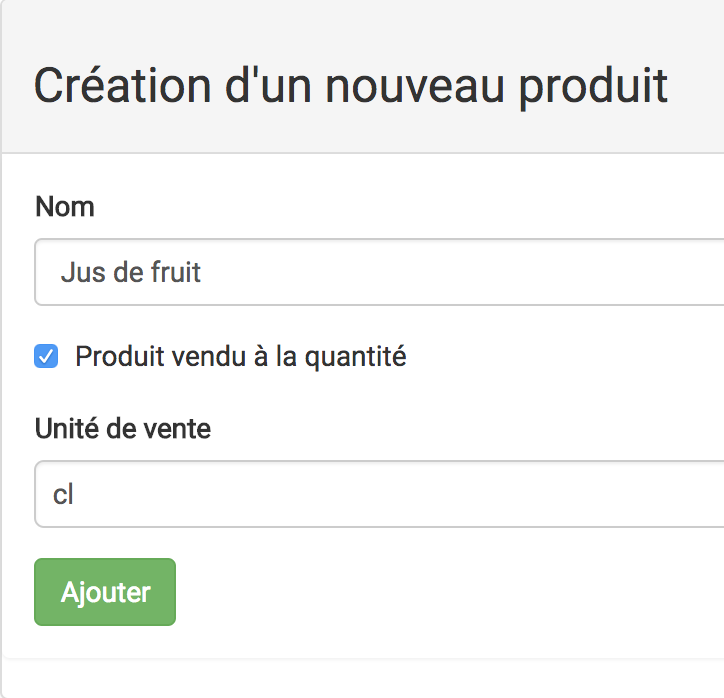
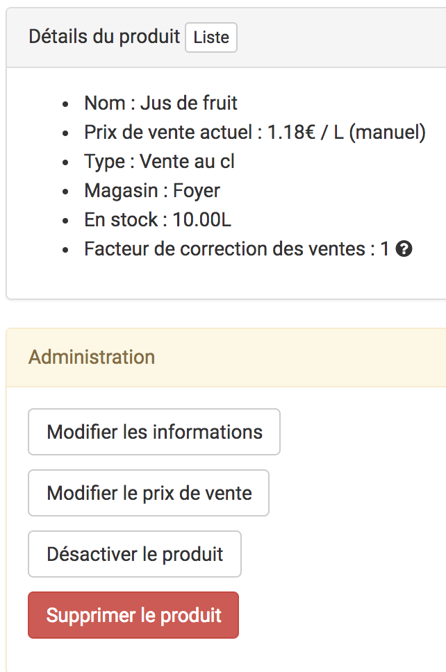
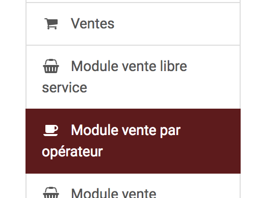
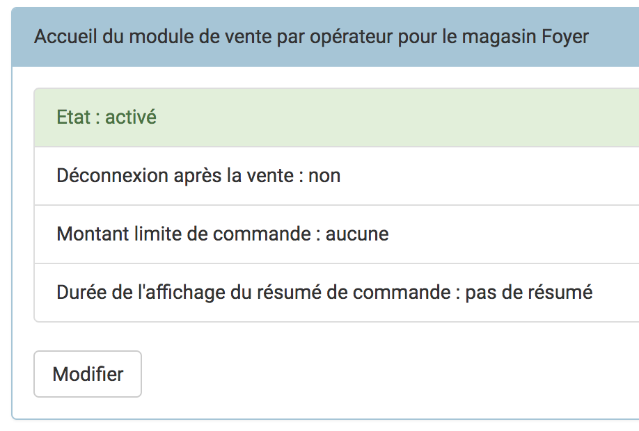
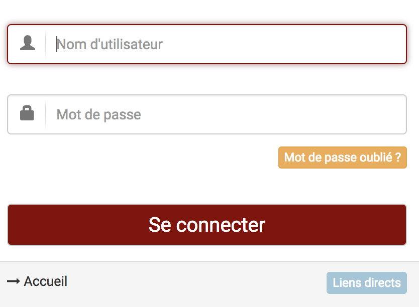
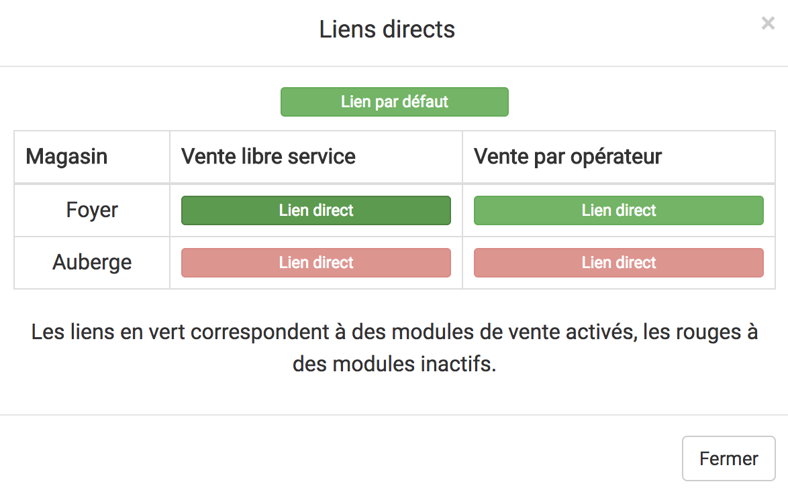

   

# Documentation - Gestion d'un magasin

## Application

Build : [4.5.0 + ](https://github.com/borgia-app/Borgia/releases/tag/4.5.0)

Licence : [GNU GPL version 3](./license.txt)

# Introduction

Ce guide a pour objectif d'expliquer le fonctionnement de l'application de vente de Borgia.
Il détaillera la gestion des administrateurs d'un magasin, de ses produits et de ses modules de vente. Il ne s'attardera pas sur la gestion complète des stocks, qui fait l'objet d'un [autre guide](./stocks.md).

# Administrateurs du magasin

Deux types d'administrateurs peuvent gérer un magasin. Les deux groupes n'ont pas les mêmes fonctions, les mêmes permissions et ne sont pas gérés par le même groupe supérieur. Dans les deux cas, les membres peuvent accéder au "Workboard" du magasin en changeant de groupe dans le menu latéral (`Groupes / Chefs ou Associés NOM_DU_MAGASIN`).

## Chefs du magasin

Le groupe le plus important d'un magasin est le groupe des chefs du magasin. Le nom complet est "Chefs **NOM_DU_MAGASIN**".

La gestion de ce groupe est laissé par défaut aux groupe des présidents et des vice-présidents. C'est donc à eux de définir qui fait partie de ce groupe principal du magasin. Pour modifier les membres, cliquer sur `Gestion des groupes / Gestion chefs NOM_DU_MAGASIN` dans le menu latéral.

Par défaut, ce groupe a la permission de :

* Ajouter, lister et accéder aux détails des utilisateurs.
* Ajouter de l'argent à un utilisateur.
* Ajouter, modifier, lister, accéder aux détails et modifier les prix des produits (de ce magasin uniquement).
* Lister et accéder aux détails d'une vente (de ce magasin uniquement).
* Vendre des produits avec le module de vente par opérateur.
* Ajouter, lister et accéder aux détails des inventaires et des entrées de stocks (de ce magasin uniquement).
* Gérer les membres du groupe des associés de ce magasin.

L'ensemble des permissions peuvent être données à ce groupe par les présidents ou les vice-présidents.

Théoriquement, ce groupe ne devrait contenir qu'un petit nombre de membres: uniquement le(s) chef(s) du magasin élu ou choisi au sein des administrateurs de celui-ci. Les autres devraient faire partie du groupe des associés.

## Associés du magasin

Ce second groupe est un cran en dessous des chefs en terme d'administration mais peuvent totalement disposer des mêmes permissions.

Ce groupe est directement gérés par le groupe des chefs du magasin. Ainsi, il est aisé d'ajouter et de supprimer des membres à ce groupe en cas de besoin (par exemple lors d'une soirée importante qui nécessite un grand nombre de collaborateurs pour la vente).

Ce groupe ne peut pas recevoir l'ensemble des permissions, mais seulement celles qui sont appliquées aux chefs du magasin. Ainsi, un associé ne peux pas avoir une permission dont un chef du même magasin ne dispose pas. Par défaut, ces permissions sont :

* Ajouter, lister et accéder aux détails des utilisateurs.
* Ajouter de l'argent à un utilisateur.
* Ajouter, modifier, lister et accéder aux détails (de ce magasin uniquement).
* Lister et accéder aux détails d'une vente (de ce magasin uniquement).
* Vendre des produits avec le module de vente par opérateur.
* Ajouter, lister et accéder aux détails des inventaires et des entrées de stocks (de ce magasin uniquement).

# Gestion des produits

Les produits sont les éléments qui sont vendus au magasin à travers les différents modules de vente. Il convient de les utiliser correctement pour s'assurer que la gestion des stocks est cohérente et que le prix de vente correct.

## Ajouter un produit

Borgia offre deux types de produits pour les magasins : les produits unitaires et les produits vendus à la quantité. La différence est essentielle et fondamentale pour bien utiliser l'application des produits de Borgia.

### Produit unitaire

Un produit unitaire (aussi nommé produit tout court) est le produit de base de Borgia. L'acheteur repart avec l'intégrité du produit en une fois et il disparait physiquement du stock. Par exemple, une bouteille de bière, un écusson ou encore une blouse sont des produits basiques et unitaires.

L'ajout d'un tel produit ne nécessite qu'un nom de produit (qui sera le nom de vente).

### Produit vendu à la quantité

Un produit vendu à la quantité ne disparait pas physiquement du stock lorsqu'il est vendu. En effet, seulement une petite partie de son état est vendu à chaque fois.

Par exemple, de la bière provenant d'un fût est un produit vendu à la quantité. De même, le fromage ou le pain vendu au poids en font partie. Bien sûr, ce n'est pas limité aux produits alimentaires.

L'ajout d'un tel produit nécessite un nom et aussi une unité de vente : gramme ou centilitre.

### Détails d'un produit

L'ensemble des informations d'un produit est disponible dans en cliquant sur "détails" pour le produit concerné dans la liste des produits du magasin.

La page qui s'affiche indique les informations du produit ainsi que les différentes manipulations possibles à effectuer (voir la suite).

## Activation / suppression

Un produit peut être désactivé ou supprimé en cas de besoin.

Lors de la désactivation, le produit :
* n'est plus visible à la vente.
* reste présent dans la liste des produits.
* peut être réactivé à tout moment, cette action est reversible.

Et lors de la suppression, le produit :
* disparait purement et simplement de Borgia.
* il n'est plus modifiable, visible dans les listes ou disponible à la vente.
* cette action est irreversible.

Ainsi, la suppression d'un produit est à réserver si une erreur a été faite concernant ce produit. Si l'objectif est simplement de le retirer de la vente temporairement, la désactivation est à privilégier.

## Gestion du prix de vente

Borgia gère automatiquement le prix de vente des produits en utilisant les données d'entrées et de sorties du stocks (voir la section stock pour plus d'informations). De plus le paramètre qui indique la marge de vente à appliquée est utilisé et défini dans la configuration de Borgia.

De plus, il est possible d'utiliser un prix défini manuellement pour chacun des produits en cliquant sur le bouton `Gestion manuelle du prix`.

Si c'est le cas, Borgia indique la déviation par rapport au prix qu'il calcule afin d'informer les administrateurs de la cohérence ou non du prix manuel.

## Stock

Cette section fait l'objet d'un [guide à part entière](./stocks.md).

Noter simplement qu'un produit ne peut pas être vendu s'il n'y a pas encore eu d'entrée de stocks. Sinon le prix de vente sera nul et Borgia refusera de l'afficher dans les modules.

# Modules de ventes

L'objectif principal des produits et de l'application magasin est de vendre des choses par l'intermédiaire pour l'association de Borgia.

## Deux types de modules

Afin de proposer des produits aux membres et utilisateurs du site, deux modules de vente différents sont disponibles. Les deux modules fonctionnent à peu près de la même façon, leur configuration n'est donc pas différenciée dans ce guide et est indiquée par la suite.

Le premier est le module de "vente directe". Il autorise les utilisateurs à indiquer eux-même leurs achats via une interface simplifiée. Tout fonctionne sans l'intervention d'un administrateur du magasin et est donc basé sur la confiance entre les membres et l'association. Pour activer et configurer ce module, il faut cliquer sur "Module vente libre service" dans le menu latéral.

Le second est un module équivalent mais disponible uniquement pour les gestionnaires du magasin. La vente est donc approuvée par un administrateur directement. Ce module est nommé "Module vente par opérateur".

## Configuration

En cliquant sur le lien du module dans le menu latéral, la page de configuration s'ouvre. La section du haut indique les paramètres actuels du module, notamment s'il est activé ou non.

Pour modifier ces paramètres, cliquer sur le bouton "Modifier".

## Catégories de vente

La seconde section indique les produits qui sont disponibles à la vente.

Ils sont organisés par catégories que l'on peut ajouter, modifier et supprimer à la volée. Le nom de la catégorie est associée au nom affiché dans l'onglet sur l'interface utilisée par les utilisateurs.

Un produit peut être ajouté à plusieurs catégories en même temps. Si c'est un produit vendu à la quantité, il faut indiquer la quantité vendu à chaque fois. Par exemple 25 cl pour un verre, 50 pour une pinte etc.

## Accès aux modules

Une fois activés, les modules de vente sont accessibles par les utilisateurs.

Les module de vente font l'objet d'une page de login spécifique qui doit être sélectionnée en cliquant sur le bouton vert "liens directs" sur la page de login usuelle.

En plus de ces liens, des redirections sont disponibles dans le menu latéral. Par le groupe "Gadz'Arts" via "Vente directe **NOM_DU_MAGASIN**" et "Module vente" par les groupes des chefs et associés du magasin en question.

# Bilan de santé
